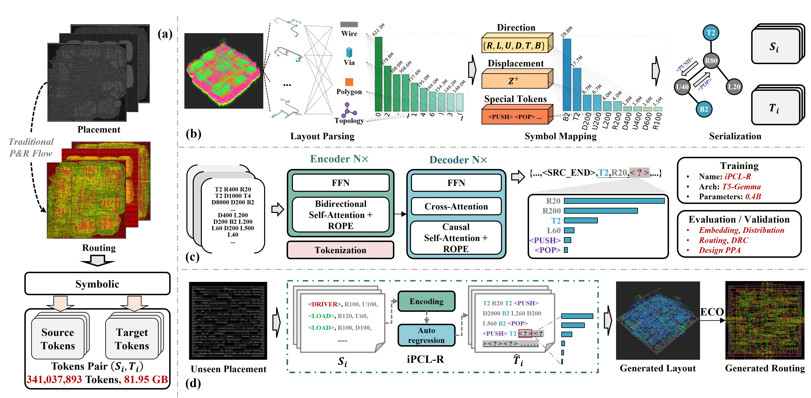

<div align="center">


<h3> A Pre-training foundation model for Chip Layout Routing </h3>

<p align="center">
    <a title="GitHub Watchers" target="_blank" href="https://github.com/OSCC-Project/iPCL-R/watchers">
        
    </a>
    <a title="GitHub Stars" target="_blank" href="hhttps://github.com/OSCC-Project/iPCL-R/stargazers">
        
    </a>
    <a title="GitHub Forks" target="_blank" href="https://github.com/OSCC-Project/iPCL-R/network/members">
        
    </a>
</p>

</div>

## Demo of iPCL-R

<div align="center">

<h3> A chip layout generation demo by iPCL-R </h3>
</div>

## Project Overview

<div align="center">

<h3> The framework of iPCL-R.
    (a) Dataset. (b) Symbolic system. (c) Pre-training. (d) Inference. </h3>
</div>

iPCL-R addresses the challenge of automated routing pattern generation in chip design by treating routing patterns as sequences that can be learned and generated by large language models. The project implements a complete pipeline from EDA data extraction to model training and routing generation.

### Table of Contents
- [Demo of iPCL-R](#demo-of-ipcl-r)
- [Project Overview](#project-overview)
  - [Table of Contents](#table-of-contents)
  - [Key Innovation](#key-innovation)
- [Architecture](#architecture)
- [Core Modules](#core-modules)
  - [Data Synthesis Module](#data-synthesis-module)
  - [Flow Module](#flow-module)
    - [Stage 1: Tokenization](#stage-1-tokenization)
    - [Stage 2: Training](#stage-2-training)
    - [Stage 3: Evaluation](#stage-3-evaluation)
  - [Experiments Module](#experiments-module)
  - [AiEDA Third-Party Module](#aieda-third-party-module)
- [Quick Start](#quick-start)
  - [Prerequisites](#prerequisites)
  - [Basic Usage](#basic-usage)
    - [Pipeline Execution](#pipeline-execution)
    - [Dataset Construction](#dataset-construction)
    - [Experimental Analysis](#experimental-analysis)
- [Research Applications](#research-applications)
- [Evaluation Metrics](#evaluation-metrics)
- [Contributing](#contributing)
- [Citation](#citation)

### Key Innovation
- **Domain-specific tokenization** optimized for spatial reasoning tasks in chip routing
- **Transformer-based sequence-to-sequence models** for routing pattern generation
- **Comprehensive evaluation metrics** combining NLP and routing-specific measures

## Architecture

The project is organized into four main modules:

```
iPCL-R/
├── flow/              # [Main] 3-stage ML pipeline (tokenization → training → evaluation)
├── data_synthesis/    # [Optional] EDA data processing and ML-ready dataset generation
├── experiments/       # [Optional] Experimental analysis and validation studies
└── third_party/       # EDA tool integration and chip design automation
```

## Core Modules

### Data Synthesis Module
**Purpose**: Convert EDA design data into large model learning-ready formats

**Key Components**:
- **MetadataTracker & DataGenerator**: Base infrastructure for data generation with Parquet output
- **NetPatternProcessor**: Processes wire routing patterns and calculates directions  
- **NetGraphProcessor**: Converts routing networks into NetworkX graphs
- **DesignGraphProcessor**: Creates design-level graphs with spatial overlap detection
- **DatasetAggregator**: Consolidates data into HuggingFace Dataset format

**Data Types Generated**:
- `net_seqs`: Network sequence representations with driver/load information
- `pin2pin_pattern_seqs`: Pin-to-pin routing pattern sequences  
- `pin2pin_loc_seqs`: Spatial location sequences for routing paths
- `design_graph`: Design-level connectivity and overlap graphs

### Flow Module  
**Purpose**: Complete 3-stage pipeline for routing pattern generation

**Pipeline Stages**:

#### Stage 1: Tokenization
- **UnifiedTokenizer**: Supports 5 algorithms (DecimalWordLevel, Seg-BPE, Concat-BPE, Seg-BBPE, Concat-BBPE)
- **Direction Encoding**: Converts 3D coordinates to directional tokens (R/L/U/D/T/B)
- **Tree Structure**: Handles routing trees with PUSH/POP and BRANCH/END tokens
- **Special Tokens**: BOS/EOS, PAD, DRIVER/LOAD for routing semantics

#### Stage 2: Training
- **Custom Architecture**: T5-Gemma encoder-decoder transformer
- **Multi-optimizer Support**: AdamW, Adafactor, Lion optimizers
- **Distributed Training**: HuggingFace Accelerate integration
- **Monitoring**: TensorBoard and comprehensive logging

#### Stage 3: Evaluation  
- **Multi-metric Assessment**: NLP metrics (ROUGE, BLEU) + routing-specific (RED)
- **Validation Pipeline**: Coordinate parsing, tree structure analysis
- **EDA Integration**: DEF format output for industry tool verification

### Experiments Module
**Purpose**: Validation and optimization studies for the pipeline

**Research Areas**:
- **Tokenization Comparison**: Statistical analysis of 5 tokenization algorithms across multiple vocabulary sizes
- **Model Architecture Studies**: Parameter count vs. performance analysis (small/medium/large variants)
- **LLM Fine-tuning**: Supervised fine-tuning with LoRA, multi-GPU support, comprehensive evaluation
- **Symbol Analysis**: Domain-specific vs. human language tokenization comparison
- **Feature Ablation**: Input feature importance analysis (planned)

**Key Methodologies**:
- Multi-stage filtering for coordinate validation
- Tree structure integrity checking  
- Statistical significance testing
- Comprehensive visualization and reporting

### AiEDA Third-Party Module
**Purpose**: Extract features (metadata) from physical design files and write the generated results back to the physical design file (DEF)

**Integration**: Provides EDA backend infrastructure and large model data generation for the iPCL-R project.

## Quick Start

### Prerequisites
```bash
# Install dependencies
pip install -r requirements.txt

# Key dependencies include:
# torch, transformers, datasets, accelerate, networkx, pandas, tqdm
```

### Basic Usage

#### Pipeline Execution
```bash
# Generate pipeline configuration
python -m flow.pipeline_init --create-flow-config config.json

# Read the config guide in 'flow/README.md'
vim config.json

# Execute 3-stage pipeline
python -m flow.launch_tokenization --flow-config config.json
# Configure your accelerate settings as needed (e.g., run 'accelerate config' for initial setup)
accelerate launch -m flow.launch_training --flow-config config.json  
accelerate launch -m flow.launch_evaluation --flow-config config.json
```

#### Dataset Construction
If you wish to build your own dataset, please organize your data following the AiEDA framework (I sincerely do not recommend this, as it involves extensive engineering dependencies), and utilize the 'data_synthesis' module of this project to assist in the construction of the dataset.
```bash
python -m data_synthesis.main_aggregation
```

#### Experimental Analysis
The experiments and the code for generating the figures in this work are located in the 'experiments' directory. Due to issues such as log extraction and path dependencies, it is not convenient for users to run them with a single click. Therefore, this module is for reference only.

## Research Applications

iPCL-R enables research in:
- **Spatial AI**: Neural networks for 2D/3D coordinate reasoning
- **Domain-specific Tokenization**: Optimization for spatial/geometric data
- **EDA Automation**: AI-driven chip design optimization
- **Graph Neural Networks**: Routing network topology analysis
- **Transfer Learning**: Pre-trained models for chip design tasks

## Evaluation Metrics

- **NLP Metrics**: ROUGE, BLEU, exact match for sequence similarity
- **Routing Metrics**: RED (Routing Edit Distance), coordinate accuracy
- **Structural Metrics**: Tree validation, connectivity analysis  
- **Quality Metrics**: Manufacturability, design rule compliance

## Contributing

This is a research project focused on the intersection of machine learning and electronic design automation. The modular architecture allows for easy extension of tokenization algorithms, model architectures, and evaluation metrics.

## Citation

If you use iPCL-R in your research, please cite:

```bibtex
@software{ipcl_r_2025,
  title={iPCL-R: Pre-training for Chip Layout Routing},
  author={Weiguo Li},
  year={2025},
}
```
